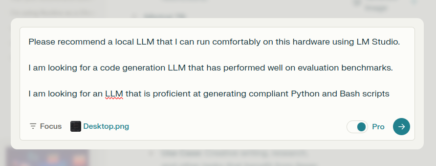

# Prompting Strategy: Use An LLM To Recommend A Local LLM Optimised For Your Hardware

*(Also: how to set context really easily by saving a few PNGs!*)*

05-11 (Nov)-24

An extremely simple but effective approach to leveraging the ability of context to dramatically improve LLM outputs can be demonstrated by asking an LLM to recommend a good local LLM that you can run on your hardware. 

Given how quickly the LLM space is evolving, I recommend using something like (yes, it's simple but effective) GPT-4o via the web UI. It stands some chance of keeping up with what's going up on Hugging Face (etc). Anything with a training data cutoff beyond (say) six months ago is probably - in AI terms - already too old and fuddly for this task.

Here's how this prompting strategy works as I've been refining it:

## Step 1: Note your hardware as a context snippet

Firstly, I recommend setting up a **context repository** just for this purpose. If like me you use LLMs both for personal and professional purposes, set up a separate 'context repo' for both.

It doesn't have to be anything fancy (and it certainly doesn't need to be RAG or stored as vectors for small insertions). A glob of markdown files or JSON docs versioned through Github more than gets the job done:


I've experimented with noting my hardware parameters in both `JSON` format and (latterly, after I moved to a new OS) by being a bit lazy and just taking a screenshot of a previous note.

Like this:


LLMs' OCR abilities are so good that - until I see decisive evidence to the contrary - I'm going to say *"it really doesn't make a difference"*.

## How to prompt

Let's say you're using a web UI (I'll use Perplexity for this demo):

All you have to do is drag and drop the JSON/markdown note/PNG (it doesn't really matter) into the prompt window, like this:


With one quick drag and drop operation, you've just provided some quite detailed contextual info to guide this inference!

In my case, it provides details of the hardware spec of my desktop and also the exact type of Linux distro that I use. When trying to* find compatible hardware or software, these few datapoints (*what GPU? What motherboard? What distro? What PSU? OpenSUSE LEAP or Tumbleweed?*) make the difference between going on a rabbit hunt for the right tools to getting a perfectly accurate list in seconds.

For local LLM selection, these hardware parameters are hugely importrant too. You let the LLM see which GPU you have (from which it can infer the VRAM if it's not provided); your CPU; your OS etc. 

## Finally: the prompt

As ever, the key with getting good results here is to be hugely specific (much more so than you would be with a human):

Here's one I used to ask for a code generation LLM:

```
Please recommend a local LLM that I can run comfortably on this hardware using LM Studio.

I am looking for a code generation LLM that has performed well on evaluation benchmarks.

I am looking for an LLM that is proficient at generating compliant Python and Bash scripts

```

With modern LLMs, you don't need to be **massively** specific. But on older variants you might need to get down into the weeds of providing objective parameters to explain exactly what running *"comfortably"* means in this context (as after all, it's a linguistic colloquialism). Is 80% VRAM consumption "comfortable"? What about 70%? You get what I mean. 

## Do I need to tell it to use the screenshots as context?

At the time of writing, I use (mostly) GPT-4o and Claude Sonnet 3.5.

I have **not** found with either that you need to explicitly state things like:

```
I have uploaded an image with my hardware specifications. Use this as context for your generation.
```

But if you're not worried about tokenisation (and with a prompt like this, that's not likely to be a concern) you could tack that on to play it safe.

## Example output

Prompting on Perplexity (GPT-4o):



The output demonstrates that the LLM has parsed the image I supplied as context and informed its response through that lens correctly.

In the screenshot below, you can see that the LLM has considered my workstation's GPU, RAM, and CPU when making its recommendations:


## Final Tip

Quantization being a complicated topic, I often find it useful to ask the LLM to be very specific in recommending not only a model but also a specific **variant**.  Given that you've supplied your hardware as context, you may as well tack this on.

I might write something like:

```
For every recommendation, provide both the model that you recommend and the specific variant.
```

And an example never hurts in boosting accuracy:

```
For example, don't recommend "Wizard Coder Python". Rather, recommend "Wizard Coder Python 7B V1.0 GGUF"
```