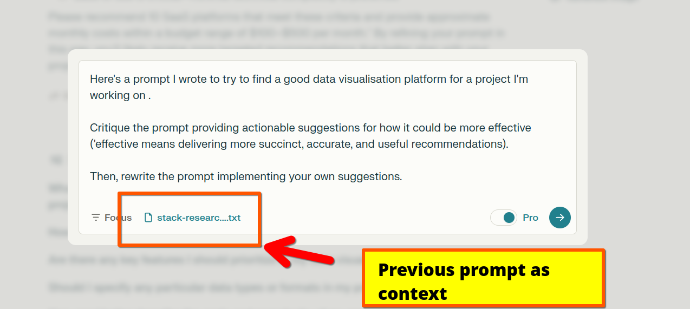
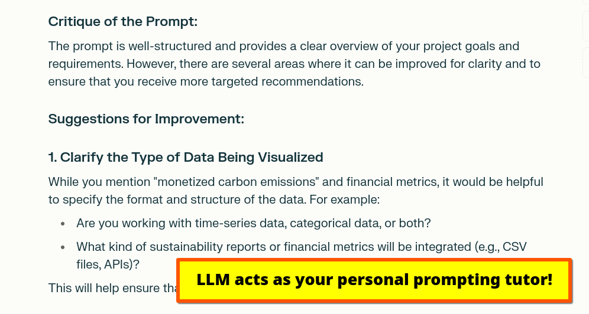
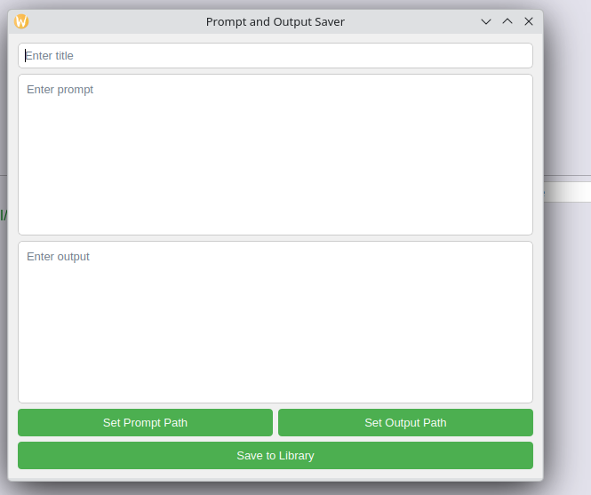

*Photo: Daniel seen working hard on his latest LLM prompt*

## Daniel Rosehill LLM Prompt Library

### The best parts (I think)

There's nothing particularly special or remarkable about this collection of prompts.

But the most interesting part might be my methodology for injecting `'context snippets'` into LLMs.

A guide to what I mean by that is [here](documentation/simple-context-setting).

But basically:

Collating small snippets of information about yourself (or your career goals, or whatever) and appending them to prompts (whether through dragging and dropping in a file; copying and pasting; or adding them programatically).

There are some examples of context snippets in `contextual-data` but there's a very, very long list of things that you any given person *might* want to record as context for improving LLM inference.  So consider it a very small smattering of examples just for the purpose of illustration.

To state the obvious: RAG is *way* more sophisticated and powerful than collating little text snippets but *(I believe and am experimenting with the idea)* that a humble snippet library can serve as the pipeline for a proper RAG system. 

Thinking a little down the line, I think we're going to need to be realistic: RAG is great but probably overskill for small personal needs. Better systems for maintaining chat memory will almost certainly displace the relevance of this approach. But we still might see independent value in curating our own library of small data about ourselves that isn't joined at the hip to any one LLM or ecosystem...

### What's here (prompts, of course, but you know..)

This repository is both a `prompt library`  *(in the sense of containing prompts that I've finished working with, for now)* as well as a prompt engineering workspace of sorts where I share my fumbling progress on prompts that I don't mind sharing with the whole world (someone's going to read this at some point, right?!)

To my friends, I might be just another person who's gone down the rabbit hole of LLM-mania. But give me a moment to tell you *why* I think this technology is both so amazing and has massive potential, and I'd begin blabbering on about "use-cases."

Like every emerging technology, hyperbole and unfounded negativity surround the subject in equal measure. If the hype of new technologies is commensurate with their potential for good (I think it is) then it's not surprising that LLM-mania is not only all-encompassing but feels, at times, even suffocating.

And as usual when promising new tech comes to market, the truth of what LLMs are useful for gets lost somewhere in the middle. 

What's not an exaggeration to say is that LLMs offer fundamentally different ways for humans to interface with information stored in computer systems. 

They're a rather big deal. But the easy familiarity that "chatting" with ChatGPT offers is also misleading. Like any hugely powerful technology, they demand an investment of time and thinking to yield their benefits. Hence learning how to refine *inputs* to get predictably better *outputs* is an emerging but important field.

## Prompt-huting: The Wild West Of The Great AI Frontier

Something else I love about exploring LLMs? 

They're a bit of a Wild West. But in a way that's oddly liberating.

Discovering the ways in which large language models can make life just a little bit easier involves a *huge* amount of trial and error. 

Good books have been written about prompt engineering. But a definitive texthbook on the subject is both elusive and probably impossible. The very *mechanisms* that make LLMs works defy total predictabiliy. 

Even with careful calibration, it's extremely difficult to get (almost) the same two outputs from the same prompt. LLM outputs are the snowflakes of synthetic brains. Although under their hoods are vast arrays of numbers, this innate variances makes them appealing for creative experimentation.

For those of us who work with LLMs professionally, prompt engineering can be both a passion and part of our job. Which is why I like the fact that doing this kind of work is often arduous, gritty, and frustrating. 

 LLMs are the masters of deadpan literalism and hugely instructive in things us humans rarely think about like the extent to which our daily speech is suffused with all kinds of colloquialisms that - interpreted literally - make almost no sense. 

 The frenzied pace of development in the LLM market is both exciting and frustrating. Among all the hype about the *potential* of AGI (etc etc) it feels like very basic topics - like who owns the IP in LLM outputs and whether anybody has thought critically about the cultural bias passed on by the selection of materials for training data- are forever destined to remain ignored. 

But perhaps, right now, that's part of the wacky appeal of these technologies.

So much is unknown about how neural networks trained on vast globs of information can shape the world for the better. With the vast amount of prompting taking place on a daily basis - and the quickly maturing potential of AI to speed up drug development through shortlisting promising molecules from vast permutations of combinations of chemicals - it's only a matter of time before the next Nobel Prize will be justifiably awarded to .... Mr Tensor Processing Unit sitting in an AWS data center somewhere in a field in a forgotten corner of the world.

Prompt engineering might be a time-limited discipline, to be displaced soon by the next means of leveraging AI. Figuring out how to *use* AI is both a moving target and a lagging one: by the time one feels the first inklings of mastery over one model an entirely new one has supplanted it. But although the field is in its infancy the first 

 To prompt *experimenteurs* that's endaring and deeply exciting. It's in that spirit of open-ended adventure that these notes are shared.

## Example Prompt

Prompting and "prompt engineering" doesn't have to be complicated. 

A huge amount can be achieved with some light touch organisation. I'll share a basic scaffold that I've developed for working with LLMs soon.

Among the huge excitement about RAG and increasingly powerful models, remarkably little attention has been paid to the boring but rather important question of how users (especially businesses) should *store* the information generated by generative AI tools. 

Many regard the very idea of *storing* generations - or of framing AI outputs as anything analogous to "knowledge"

The steps:

- Invest time and effort in writing a very detailed "stack research" prompt  
- Save it to your prompt library as a markdown or text file (if there's formatting that helps to show the prompt's structure, markdown is preferred)  
- Before you run it, feed it through an LLM and ask for tips to improve it  

And this gets you:

---

## A Big Glob Of Prompts And Outputs

I've shared some of my prompts and outputs on:

[DanielGoesPrompting.com](https://danielgoesprompting.com)
(*Yes, creative inspiration was running thin that day)*

---

## While You're Here, This Might Be Useful: GUI For Automatic Prompt Extraction

See `GUIs` for a prompt to create a simple (but functional!) Python GUI for saving and extracting prompts into a local prompt library/repository.

 

## Author

Daniel Rosehill  
(public at danielrosehill dot com)

## Licensing

All my GitHub repositories are licensed under [Creative Commons Attribution 4.0 International](https://creativecommons.org/licenses/by/4.0/).

### Summary of the License
The Creative Commons Attribution 4.0 International (CC BY 4.0) license allows others to:
- **Share**: Copy and redistribute the material in any medium or format.
- **Adapt**: Remix, transform, and build upon the material for any purpose, even commercially.

The licensor cannot revoke these freedoms as long as you follow the license terms.

#### License Terms
- **Attribution**: You must give appropriate credit, provide a link to the license, and indicate if changes were made. You may do so in any reasonable manner, but not in any way that suggests the licensor endorses you or your use.
- **No additional restrictions**: You may not apply legal terms or technological measures that legally restrict others from doing anything the license permits.

For the full legal code, please visit the [Creative Commons website](https://creativecommons.org/licenses/by/4.0/legalcode).