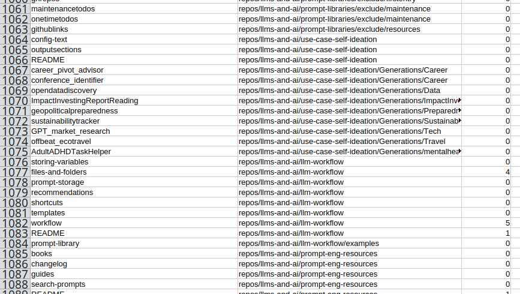

There are surely a *bajillion* and one other ways to do this, but here's (yet another) example of how easy it is to use an LLM to quickly generate a Python script to automate .... just about anything.

The use-case here: I have a project with a lot of markdown files (`.md`).

I was interested in getting a report showing me which posts didn't have any images in them. 

To do that, I prompted for a Python script to generate a `csv` that I could then run through Google Sheets (etc) and simply filter on 0 to find the posts.

## Output - an instant report

I live in perpetual awe at how Python can glob over a whole archive of a couple of thousand files and write this data in less time than it takes me to blink ... and how LLMs can generate the scripts to make that happen in just a little more time.

Run 1:

## Prompt text

Write a Python script

Its purpose is to recurse through every directory under this path and find every markdown file (.md):

`/home/daniel/Git/docs-project/site-base/docs`

It should then generate a CSV with the following columns:

filename -> the filename of the markdown file without the .md suffix
location -> relative path of the markdown file from /docs
image count -> a count of the number of images the markdown file contains. The presence of an image can be determined by a file path in the file which resolves to any common image extension (png, jpg, jpeg, webp)

The output should be written to:

`/home/daniel/Git/docs-project/repo-mgmt/reports/images-in-files`

With the format:

`{timestamp}-image-report.csv`

Where:

`{timestamp}` is today's date in the format ddmmyy