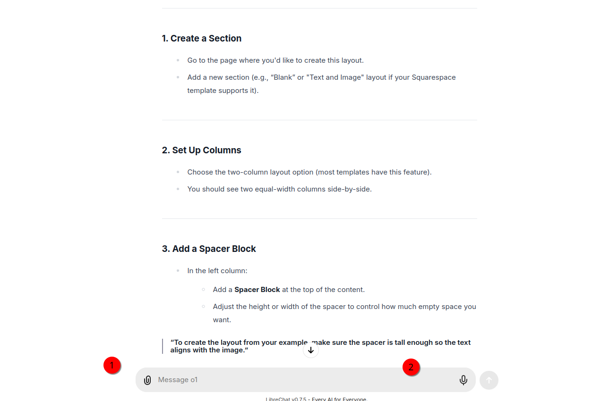
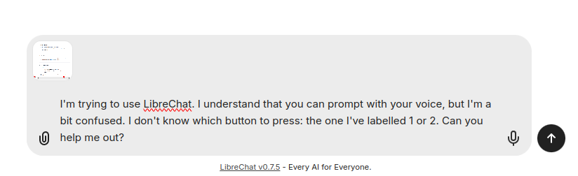
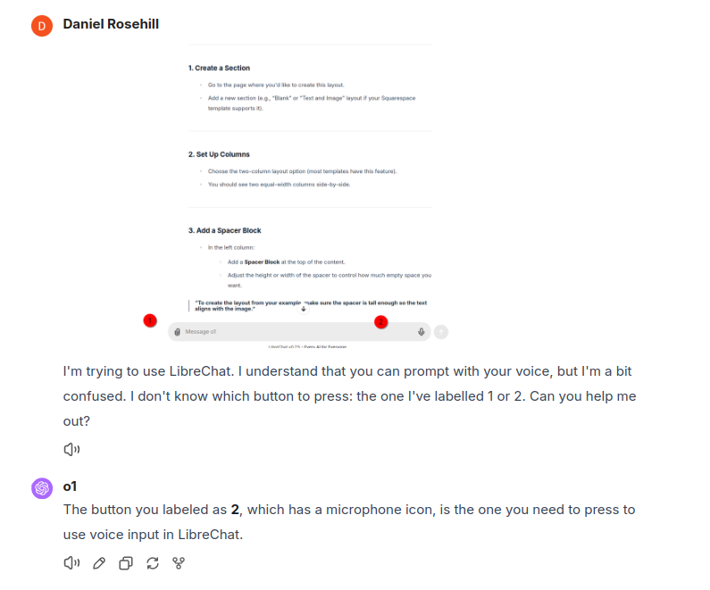

## Annotating screenshots, then prompting

If you're using an LLM that has vision capabilities, then an effective prompting strategy that's highly useful when debugging tech problems is being able to annotate the screen and direct the LLMs "attention" to it.

Very simple example:

You're stumped on something in a UI that's commonplace so rather than describe the elements you simply take a screenshot and using a screenshot tool with annotations (many of them) pass the image as context:

Then you can prompt something like:

>I can't figure out what the button I've labelled 1 is supposed to do in AutoCAD. Do you know?

If it's your first time using this approach, you can choose something really simple (like these examples) to just quickly verify that this "works" on the UI and LLM you're working with.

Choose something obvious like (I don't know!) taking a screenshot of the Microsoft Word toolbar, annotating the copy icon A, the paste icon B and prompting:

>I'm using MS Word and I'm not sure which button is for copying. Is it the one I've labelled A or B?

Assuming that the model has no difficulty in parsing the annotated image, you should get a completion like this demonstrating that the model was able to parse the text as expected:

