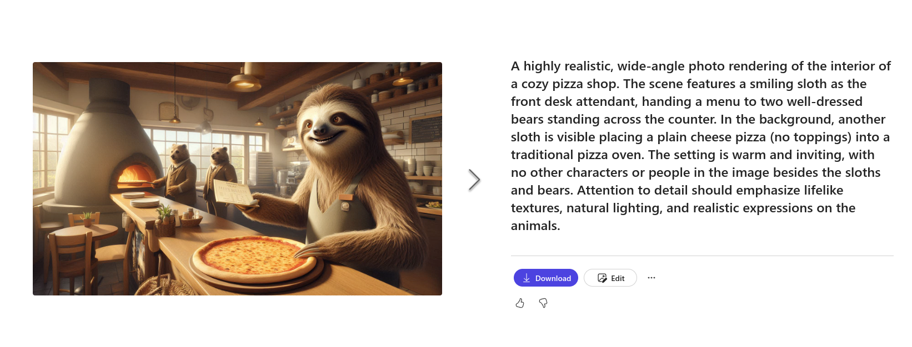

[text](image-generation.md)

## Asking an LLM to be your prompt engineering coach

Although I delight in the weird sloth generations that I've sprinkled throughout much of my writing about LLMs for the past year or so, writing prompts for image generation is *not* my specialty (my serious LLM work involves data projects, so the images are really just a quirky past-time to keep me amused and occasionally do the same for other overgrown kids!)

Now and again I muster up the conviction to ask an LLM to tear into my prompts so that I can try to get a handle on how I could be writing them better as .. you know ... life is too short to be getting lousy sloth photos out of AI...

Here's a quick template I used to ask GPT-4o to critique a prompt that I knew was pretty lackluster and perfunctory.

## Example of this prompt

Improve this image generation prompt.

Firstly, give me a better version.

Then, explain to me what you did to improve it.

Here's the prompt:

> A wide angled photo inside a pizza shop. The front desk person is a sloth who is smiling and handing a menu to two customers who are well dressed bears. In the background you can see another sloth putting a pizza into an oven. It should be a very realistic photo rendering, lifelike. Besides the sloths and the bears, there shouldn't be anybody else in the photo. The pizza doesn't have any toppings on it.

## GPT 4-o Output

### Improved Prompt

>A highly realistic, wide-angle photo rendering of the interior of a cozy pizza shop. The scene features a smiling sloth as the front desk attendant, handing a menu to two well-dressed bears standing across the counter. In the background, another sloth is visible placing a plain cheese pizza (no toppings) into a traditional pizza oven. The setting is warm and inviting, with no other characters or people in the image besides the sloths and bears. Attention to detail should emphasize lifelike textures, natural lighting, and realistic expressions on the animals.

### Explanation of Improvements

1. **Clarity and Focus**:
   - Replaced "very realistic photo rendering" with "highly realistic, wide-angle photo rendering" to emphasize both realism and the desired camera perspective.
   - Specified "cozy pizza shop" to establish a clear atmosphere for the setting.

2. **Enhanced Descriptions**:
   - Added details like "warm and inviting" to create a more vivid mental image of the environment.
   - Clarified that the pizza in the oven is a "plain cheese pizza (no toppings)" to avoid ambiguity.

3. **Improved Flow**:
   - Reorganized sentences for better readability and logical flow, grouping related elements (e.g., front desk scene vs. background activity).

4. **Natural Lighting and Textures**:
   - Included "natural lighting" and "lifelike textures" to guide rendering engines toward more photorealistic results.

5. **Avoiding Overcrowding**:
   - Reiterated that there should be "no other characters or people" to ensure simplicity in composition.

These changes make the prompt more specific, visually rich, and aligned with how image generation models interpret instructions, improving the likelihood of achieving the desired output.

## The not-so-stellar results...

Sometimes I like my random sloth guys on the first run. But more commonly there are problems like pseudotext and other things that I'm just not into that I try to fix.

Despite GPT's best efforts, I didn't really end up likely *any* of my pizza shop prompts. But this was probably my favorite among them!

