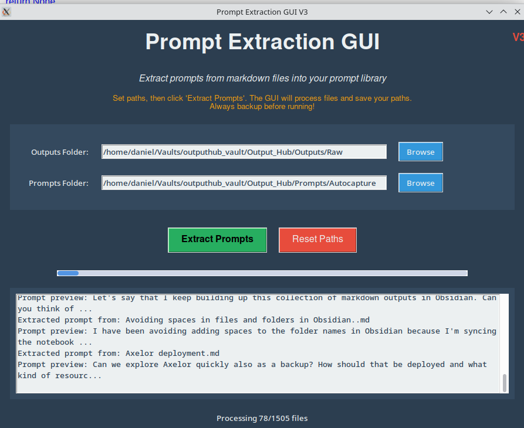

# Use an LLM to code a prompt extraction GUI!


Rather than pretend that I know more about Python programming than I do, I'll be honest and say that I'm a Python imposter. 

While I strive to improve my understanding of the syntax, many scripts and GUIs that I slap together are mostly generated by .... you guessed it ... LLMs.

The good news is that many of the scripts that LLMs author actually .... work (I'm still amazed by this).

Exhibit A: a Python GUI for extracting prompts from an Obsidian vault containing prompts and outputs jumbled together in loosely delineated templates:



While it's a good idea to keep a separate repository of your prompts and to curate it intentionally, sometimes you may wish to extract prompts from a big hunk of markdown files that contain prompts and outputs hopelessly jumbled together in an admixture of data. 

But even if you've denoted `Prompts` and `Outputs` you can usually prise them apart.

Try something like:

## A prompt to create a GUI for extracting prompts

```
Generate a Python GUI.

The program will go through a directory of markdown files.

Its base directory is:

{path}

The program should recurse through that base directory and process every markdown file (.md, .mdx).

The program will find markdown files that follow this template:

# Prompt

{Prompt text}

# Output

{Output text}

The program should copy the text of the prompt {prompt text} and write it as a new markdown file in this directory:

{path 2}

The filename of the prompt should be {filename}_prompt.md - where {filename} is the file name of the file the prompt was originally derived from. 
```

## Obsidian users: you can generate backlinks too!

Something I discovered during an early iteration of this process:

With a bit of prompting (or scripting) you can even get your program/GUI/CLI (as you prefer) to automatically create the backlinks between your prompts + outputs and your prompts.

Needlessly to say, and however you create it, the script can be tailored to your individual requirements. 

You may wish to *extract* (remove) the prompts from the original files so that the original files are just the outputs. Or parse the note into its constituent elements. 

Using basically this technique, I've created GUIs that can be run incrementally and work reliably to extract prompts from original outputs.

*(The one caveat: if you're not massively specific about how you denote prompts and outputs in a template you may wish to integrate an instruction to use fuzzy logic in your prompt text)*