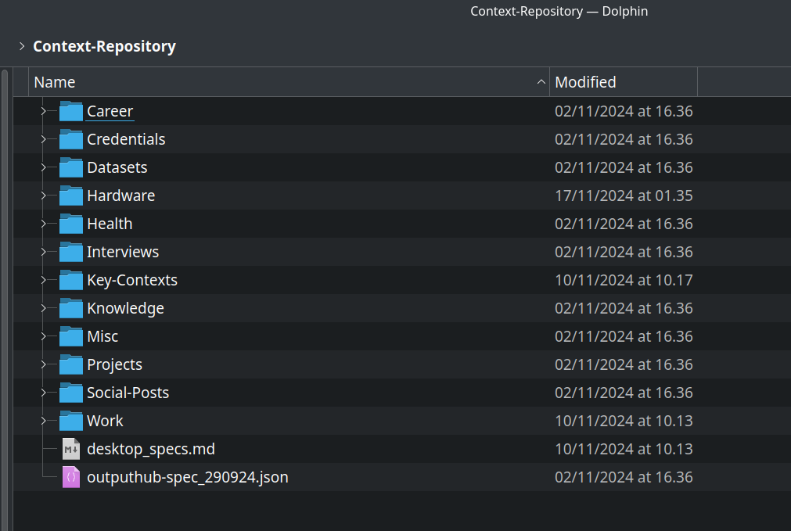
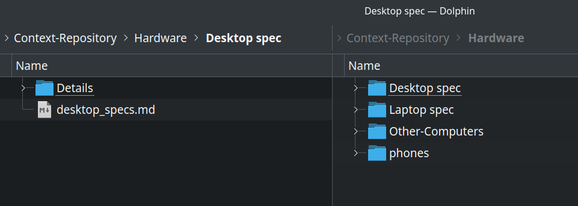
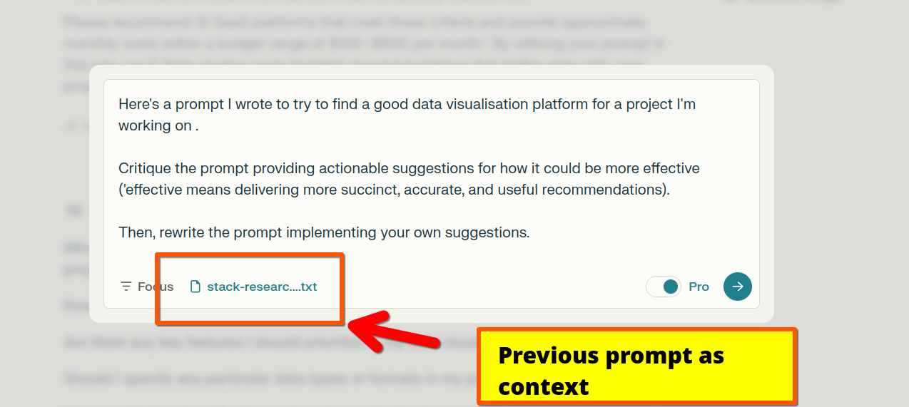
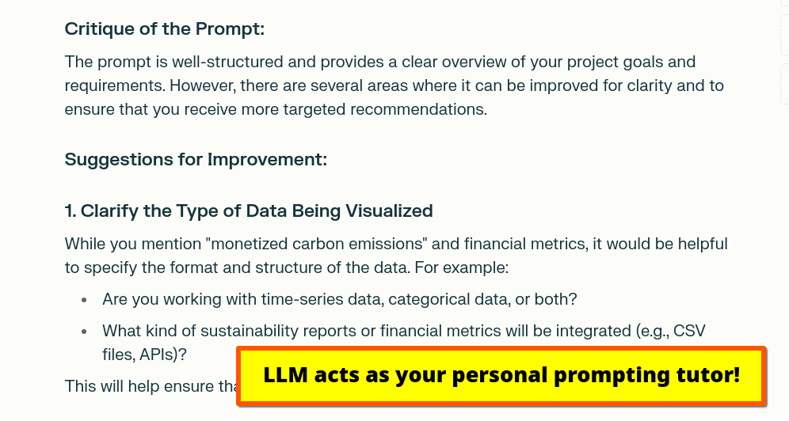

# Really easy context-setting with LLMs

If you've spent any amount of time working with large language models (LLMs), you've probably experienced the **highly annoying** phenomenon known as:

>"Oh crap, I guess this thingy has forgotten about me. Darn it, ChatGPT, I thought you smarter than this!

The technical term for that moment when you feel like throwing a brick through your computer screen is *losing context.*

Frequently, context drops out of the *context window*. 

When you prompt an LLM (input) your text gets converted into tokens. As the LLM generates an output (inference) the depth of information it has to keep track of gradually expands. The context window keeps expanding until ultimately ..... stuff falls out.

## Easy fix: a simple text library of context files

 One way to retain context is to have the LLM be able to poll a bank of data that contains context (see: RAG / retrieval augmented generation). 
 
 But for those of us using LLMs in more casual contexts (or in which our goal is less *"I wish this could access our CRM* and more "*I wish this thing could remember where I lived!*) we can hack around the system a little by just keeping some snippets of our life on file, as it were.

 A personal context repository doesn't have to be something glamorous or complicated. It can just be ... a bundle of markdown files (or a Google Drive folder):

 

 Organise as makes sense:

 

## Using LLMs to build out your own 'context repo'

You can structure your "context repository" as you see fit. You might wish to manage separate repositories for your work and personal life. 

Your personal context repo might contain any health conditions you have; or more optimistically a summary of your life mission, the values you hold dear, and your political beliefs. Your professional repo might contain the text data in your resume; your current certifications; your career aspirations; your boss's name.

You can build this out on an ad-hoc basis, as you prompt, or you can try to take a more systematic approach to generating your context repo.

For the latter, I've experimented with two approaches:

- Using an LLM to perform a "context interview" (yes, this is truly meta!) 
- Using LLMs to ideate lists of contextual snippets to fill out  
 
 ## Method 1: LLM Context "Interviews"

 

 As AI uses come, this one is admittedly pretty weird.

 Prompt an LLM with a long context window (Google AI Studio is ideal for this purpose).

 Your initial prompt should instruct the assistant that its job is to interview you for the sole purpose of generating short snippets of contextual data about you.

### Model Prompt To Start Context-Gathering "Interview"

 You are a helpful assistant whose purpose is to ask me questions at random for the purpose of gathering contextual information about me. 
 
 Ask me anything you please. 
 
 When you feel that you have gathered enough information about a specific topic to create a short summary document, inform me and then output that document as a text file. 
 
 The text file should be a structured summary of the information you have gained about a specific topic.

 Here's an example:

Filename:

 `place-of-residence.md`

Content:

`Daniel lives in Jerusalem and has lived there for the past 10 years. Prior to moving to Jerusalem he lived in Cork and London.`

## Method 2: Ideate And Complete

The second method I've used for generating contextual data quickly is by prompting an LLM to come up with a *big* list of possible topics for this purpose. 

This is a nice prompt to use with a variable as you may wish to drill down the contextual repository you're developing into specific areas. 

For example: when I asked an LLM to generate 500 suggestions for contextual snippets that could cover almost every conceivable facet of my life, I received an impressive but overwhelming trove of suggested topics. 

So I narrowed it down a little.

> I am developing a folder of contextual data designed to capture key details about my life and professional responsibilities. Suggest 10 topics for each of the following: my personal life, my professional life. Here are some examples of files that you could suggest: careers-goals.md, current-job.md. Provide a list of files.

Once you're happy with the list of topics, go ahead and fill them out. 

# How to use your context snippets

Finally .... how to use these.

The basic formula:

- Prompt  
- Context snippet (drag and drop into editor)

You can store your nuggets of contextual data however you please. `json` and `md` are widely recommended for this purpose, but multimodal LLMs have an easy time parsing text embedded in images too. 

Write a prompt:

Then drag and drop your snippet

## Examples of promptig with context

Let's say we have two context snippets: `career-goals.md` and `current-job.md`.

We can prompt:

> I'm attaching details about my current job and my current career goals. Analyse how I can leverage my current responsibilities to move towards those goals as effectively as possible.

Let's say we have recorded the hardware of our computer in a file called `my-pc.md`. Dragging that into a web UI we could prompt:

>I'm working with local LLMs. Can you suggest a GPU upgrade that's compatible with the other components in my computer?

Let's say that we have a screenshots of LLMs available from LM Studio and that same snippet detailing our desktop hardware.

We could prompt:

>I'm attaching details of my current hardware and the LLMs I could install for this project. Which would be the best fit for my hardare?

Happy exploring!