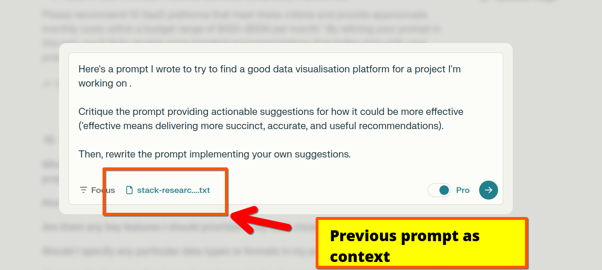

# Welcome To Daniel's Prompt Library!

*Photo: Daniel seen working hard on his latest LLM prompt*

This repository is both a `prompt library`  *(in the sense of containing prompts that I've finished working with, for now)* as well as a prompt engineering workspace where I share my fumbling progress on prompts that I don't mind sharing with the whole world. 

For some of the most useful ones, see:

`favorites.md`

---

## Example Prompt

I love discovering new use-cases and prompting strategies for LLMs!

Prompting and "prompt engineering" doesn't have to be complicated. 

My favorite method for making LLMs much more useful is storing an inventory of: previous prompts; previous outputs; context-settings snippets. 

For want of a better word, I call it my LLM "Workbench" (although I'm working on a formal GUI for it, it could just as easily be a collection of markdown files in a Github repo!)

Here's a very simple use-case that (I hope) shows why storing LLM elements like prompts and outputs can come in handy in *many* ways by enabling lots of secondary purposes like using your previous prompts to improve your current ones.

The steps:

- Invest time and effort in writing a very detailed "stack research" prompt  
- Save it to your prompt library as a markdown or text file (if there's formatting that helps to show the prompt's structure, markdown is preferred)  
- Before you run it, feed it through an LLM and ask for tips to improve it  

And this gets you:

---

## A Big Glob Of Prompts And Outputs

I've shared some of my prompts and outputs on:

[DanielGoesPrompting.com](https://danielgoesprompting.com)
(*Yes, creative inspiration was running thin that day)*

---

## While You're Here, This Might Be Useful: GUI For Automatic Prompt Extraction

See `GUIs` for a prompt to create a simple (but functional!) Python GUI for saving and extracting prompts into a local prompt library/repository.

 

---

## System / Structure

- A **prompt workspace** for drafting prompts
- A **prompt library** for storing successful prompts for reuse
- A **prompts run** for recording *all* prompts run including those not worth committing into the prompt library 
---
## Author

Daniel Rosehill  
(public at danielrosehill dot com)

---
## Licensing

All my GitHub repositories are licensed under [Creative Commons Attribution 4.0 International](https://creativecommons.org/licenses/by/4.0/).

---

### Summary of the License
The Creative Commons Attribution 4.0 International (CC BY 4.0) license allows others to:
- **Share**: Copy and redistribute the material in any medium or format.
- **Adapt**: Remix, transform, and build upon the material for any purpose, even commercially.

The licensor cannot revoke these freedoms as long as you follow the license terms.

---

#### License Terms
- **Attribution**: You must give appropriate credit, provide a link to the license, and indicate if changes were made. You may do so in any reasonable manner, but not in any way that suggests the licensor endorses you or your use.
- **No additional restrictions**: You may not apply legal terms or technological measures that legally restrict others from doing anything the license permits.

For the full legal code, please visit the [Creative Commons website](https://creativecommons.org/licenses/by/4.0/legalcode).