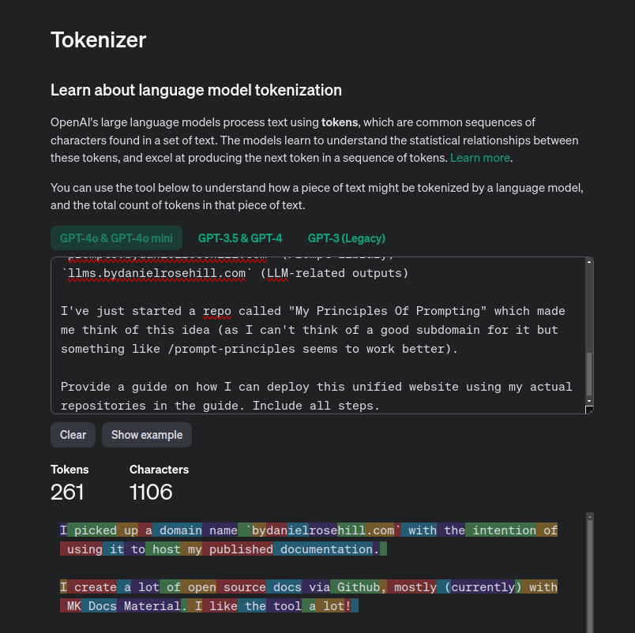

# Prompting LLMs For Personalised Documentation Generation

I chose this prompt (out of countless prompts like it that I've run) because it highlights, hopefully, a few general principles about LLM prompting as well as some specifics for this use-case.

The general use-case is this and (among the many life-transformative LLM use-cases I've been overjoyed to discover, as a documentation fiend, it's one of my favorites!):

Ask an LLM to generate personalised documentation describing how to do *exactly* what you're trying to do.

The added-value in this approach (over just finding stock documentation on Google, which if you're trying to do anything even halfway common is likely to exist) is that you can leverage the LLM to synthesise two pieces of information:

- How to do the thing you want to do (which is general knowledge)  
- How to do that thing but in the exact way that suits your implementation (which is individualised knowledge)

When you combine these two pieces of data, you get something that, up to now has been almost inconceivable: 

Individualised documentation specific to your needs generated by AI in mere seconds!

## The Secret Sauce: Specificity

The key to this prompting strategy - as always - **is being incredibly specific.**

If you're concerned about your requirements being so detailed that the prompt will be too long, consider that this mightn't really be the case. 

I calculated my prompt at 262 tokens using the [Open AI Platform](https://platform.openai.com/tokenizer) (model: 4o)



This still affords plenty of room for generating a lengthy output.
 

| Model               | Max Tokens | Used Tokens | Remaining Tokens | Approximate Word Count |
|---------------------|------------|-------------|------------------|------------------------|
| ChatGPT             | 4096       | 261         | 3835             | ~2876 words            |
| GPT-4 (via API)     | 8192       | 261         | 7931             | ~5948 words            |
| GPT-3.5 (via API)   | 4096       | 261         | 3835             | ~2876 words            |

 
## How to be specific

Frequently technical tutorials will include scripts or commands or both in the output.

For this reason, if you're generating personalised tech documentation, it pays to specify the real parameters that you're working with. 

If you feel comfortable, specify URLs or local IPs or real paths on your filesystem. This will guide the LLM towards integrating them into its output.

For example, instead of:

> I'd like to backup my desktop computer onto my local server 

Consider writing:

> I'm trying to backup my desktop computer onto my local server, whose IP address is 10.0.0.3
 
You can also use specificity as a way to disambiguate information for the LLM in your prompt.

If you're using MK Docs Material rather than MK Docs (the parent project), then specify that. 


## Prompt

>I picked up a domain name `bydanielrosehill.com` with the intention of using it to host my published documentation. 

>I create a lot of open source docs via Github, mostly (currently) with MK Docs Material. I like the tool a lot! 

>My initial plan was to deploy each site onto its own subdomain (e.g. `llms.bydanielrosehill.com`). 

>But this is kind of tedious and as many of the projects are inter-related (a lot are about LLMs for example) it strikes me as better to aim for a more unified presentation. 

>Right now there's nothing on the apex domain (bydanielrosehill.com) but I've heard that you can merge multiple MK Docs projets.

>Here are a few projects that I've already deployed:

>`prompts.bydanielrosehill.com` (Prompt Library)
>`llms.bydanielrosehill.com` (LLM-related outputs)

>I've just started a repo called "My Principeles Of Prompting" which made me think of this idea (as I can't think of a good subdomain for it but something like /prompt-principles seems to work better).

>Provide a guide on how I can deploy this unified website using my actual repositories in the guide. Include all steps.


## Prompt Parameters (Calculated 18-Nov)

Utility: OpenAI Tokenizer

 

 Tokens: 261  
 Characters: 1106
 
## Output From GPT 4-o

Here's the output as it was rendered by GPT-4o as accessed via ChatGPT:

*Generated from prompt: 18-Nov-2024*

You want to unify multiple MkDocs projects into a single site hosted on your domain (bydanielrosehill.com) instead of deploying each project to a separate subdomain. This is a great idea for providing a more cohesive presentation, especially since many of your projects are interrelated.

Here's a step-by-step guide on how to merge multiple MkDocs projects and deploy them as a unified site:

*Step 1: Install MkDocs and Required Plugins**

First, ensure that you have MkDocs installed along with the necessary tools for merging multiple MkDocs projects.

1. Install MkDocs:
   ```bash
   pip install mkdocs
   ```

2. Install the **MkDocs Merge** plugin, which allows you to merge multiple MkDocs sites into one:
   ```bash
   pip install mkdocs-merge
   ```

**Step 2: Set Up Your Master MkDocs Site**

Create a new MkDocs project that will serve as the master site where all your other projects will be merged.

1. Create a new MkDocs project:
   ```bash
   mkdocs new bydanielrosehill
   cd bydanielrosehill
   ```

2. This will create a folder with a basic structure:
   ```
   bydanielrosehill/
   ├── docs/
   │   └── index.md
   └── mkdocs.yml
   ```

3. Open the `mkdocs.yml` file and configure the basic settings for your unified site:
   ```yaml
   site_name: "Daniel Rosehill's Documentation Hub"
   nav:
     - Home: index.md
   theme: material  # Optional: You can use any theme you prefer.
   ```

 **Step 3: Merge Your Existing MkDocs Projects**

You can now merge your existing projects (e.g., `prompts.bydanielrosehill.com`, `llms.bydanielrosehill.com`, and others) into this master site.

1. Use the **MkDocs Merge** plugin to combine the projects. The general command is:
   ```bash
   mkdocs-merge run /path/to/master-site /path/to/project1 /path/to/project2 /path/to/project3
   ```

For example, if your repositories are structured like this:

```
/home/user/docs/prompts/
/home/user/docs/llms/
/home/user/docs/prompt-principles/
```

Run the command as follows:
```bash
mkdocs-merge run /home/user/bydanielrosehill /home/user/docs/prompts /home/user/docs/llms /home/user/docs/prompt-principles
```

This will merge all the specified projects into the `bydanielrosehill` directory, with each project appearing as a subsection in the navigation.

2. After running the merge command, your `mkdocs.yml` file in the master site will automatically update to include links to each of the merged projects, like so:
   ```yaml
   nav:
     - Home: index.md
     - Prompts: prompts/index.md  # Merged from prompts.bydanielrosehill.com
     - LLMs: llms/index.md        # Merged from llms.bydanielrosehill.com
     - Prompt Principles: prompt-principles/index.md  # Merged from prompt-principles repo
   ```

**Step 4: Customize Navigation and Structure**

You can further customize how the merged sites appear in your navigation by editing the `nav` section in `mkdocs.yml`. For example, you could group related projects under a single heading:

```yaml
nav:
  - Home: index.md
  - Prompting Resources:
      - Prompt Library: prompts/index.md
      - My Principles of Prompting: prompt-principles/index.md
  - LLM Documentation: llms/index.md
```

This structure will give your documentation a more unified look and feel.

**Step 5: Build and Preview Your Unified Site**

To preview how everything looks, run the following command from within your master project directory:

```bash
mkdocs serve
```

This will start a local server at `http://127.0.0.1:8000/` where you can view your combined documentation.

 **Step 6: Deploy Your Unified Site**

Once you're satisfied with how everything looks, you can deploy the unified site to your domain.

Option A: Deploy Using GitHub Pages

If you're using GitHub Pages:

1. Add a custom domain (e.g., `bydanielrosehill.com`) in your repository settings.
2. Deploy using `gh-deploy`:
    ```bash
    mkdocs gh-deploy --force --remote-branch gh-pages --config-file mkdocs.yml
    ```
3. Ensure that your DNS settings point to GitHub Pages (you may need to add a CNAME file).

Option B: Deploy Using Netlify

If you're using Netlify:

1. Push your unified project to GitHub.
2. In Netlify, connect it to your GitHub repository.
3. Configure Netlify to build using `mkdocs build` and set the output directory (`site`) as the publish directory.
4. Set up DNS in Netlify to point to `bydanielrosehill.com`.

Option C: Deploy Using Nginx

If you prefer hosting it yourself using Nginx:

1. Build the static files:
    ```bash
    mkdocs build --clean
    ```
2. Copy the contents of the generated `site/` directory to your Nginx server's web root.
3. Configure Nginx with an appropriate server block for your domain (e.g., `/etc/nginx/sites-available/bydanielrosehill.conf`).

Example Nginx configuration:

```nginx
server {
    listen 80;
    server_name bydanielrosehill.com;
    root /var/www/bydanielrosehill;

    location / {
        try_files $uri $uri/ =404;
    }
}
```

4. Restart Nginx to apply changes.

**Conclusion**

By following these steps, you'll have successfully merged multiple MkDocs projects into one cohesive documentation hub hosted on your apex domain (`bydanielrosehill.com`). This approach simplifies navigation for users and allows you to maintain related documentation in one place while still keeping each project's source files separate.

 