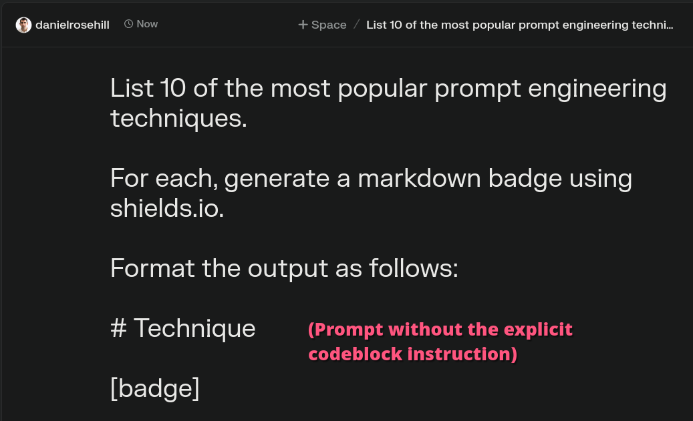
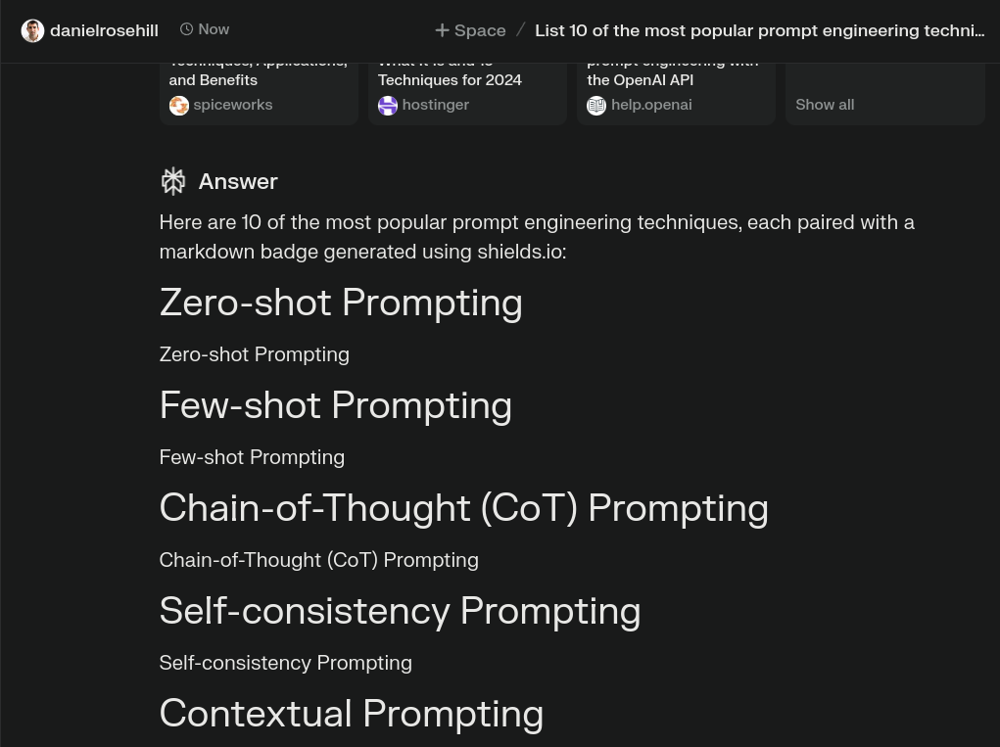
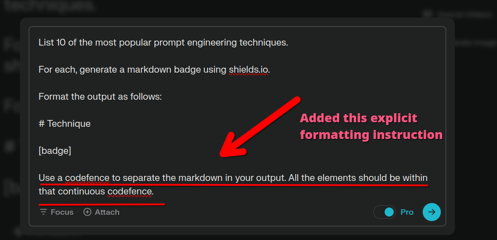
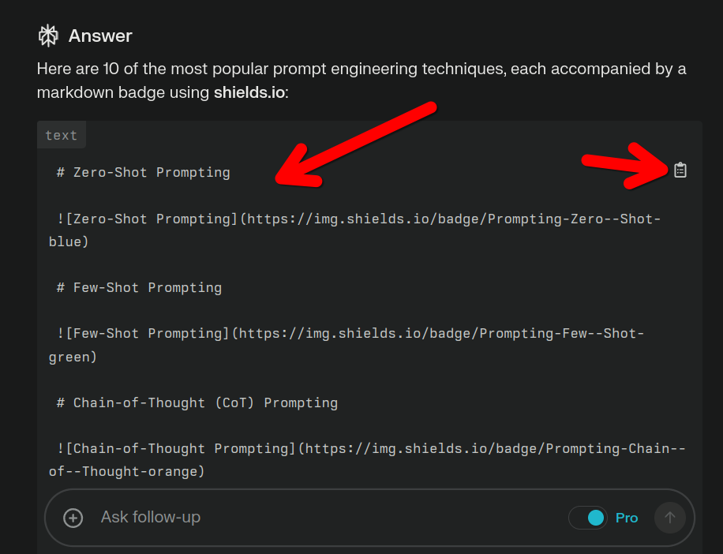

## Getting Perplexity AI to output markdown blocks

### The Issue

If you use Perplexity.AI to prompt an integrated LLM (say GPT-4o) the output, pulled from the integration, may loose some of its formatting.

The backticks (```) which are used to separate code-fences (including markdown the LLM expects you'll want to copy in isolation from the rest of the text) are often stripped

## Demo

For example:

I want to ask Perplexity to generate some nice markdown badges using the excellent Shields.io project. 

If I prompt like this:



Then we  can see that the output generated is effectively useless:



The reason: loss of codefencing.

## The Hack

Now let me show you the workaround (this isn't necessary if you're using ChatGPT directly, but I have found it essential in Perplexity).

Add an instruction like this to your prompt which explicitly tells the LLM to fence off the markdown in a codeblock so that you can copy it out:

`Format the output like this (as a continuous block of markdown)`

Or:

`Format the output as a continuous block of markdown`

For V2, I used the same prompt but with that tacked on:



And as you can see, Perplexity has now formatted its output in a way that I can use: the badges I need for my project are fenced off in a codeblock and properly formatted. I can copy them straight out of the LLM and into my web project!


