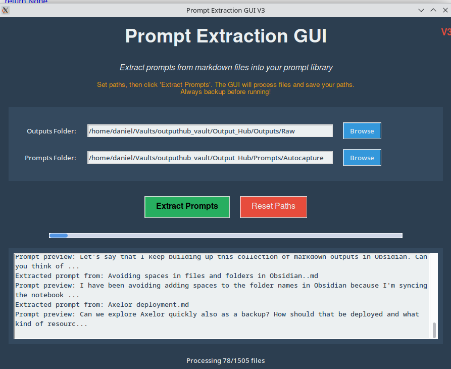

# Use an LLM to code a prompt extraction GUI!


Rather than pretend that I know more about Python programming than I do, I'll be honest and say that I'm a Python imposter. 

While I strive to improve my understanding of the syntax, many scripts and GUIs that I slap together are mostly generated by .... you guessed it ... LLMs.

The good news is that many of the scripts that LLMs author actually .... work (I'm still amazed by this).

Exhibit A: a Python GUI for extracting prompts from an Obsidian vault containing prompts and outputs jumbled together in loosely delineated templates:



While it's a good idea to keep a separate repository of your prompts and to curate it intentionally, sometimes you may wish to extract prompts from a big hunk of markdown files that contain prompts and outputs hopelessly jumbled together in an admixture of data. 

But even if you've denoted `Prompts` and `Outputs` you can usually prise them apart.

Try something like:

## A prompt to create a GUI for extracting prompts

Generate a Python GUI.

The program will go through a directory of markdown files.

Its base directory is:

`{path}`

The program should recurse through that base directory and process every markdown file (.md, .mdx).

The program will find markdown files that follow this template:

```markdown
# Prompt

{Prompt text}

# Output

{Output text}
```

The program should copy the text of the prompt {prompt text} and write it as a new markdown file in this directory:

`{path 2}`

The filename of the prompt should be `{filename}_prompt.md` - where `{filename}` is the file name of the file the prompt was originally derived from. 

Once the program has successfully extracted the prompts, it should display a message:

Success!

`{number}` prompts succesfully extracted.

Where `{number}` is the number of prompts that it processed.

The user will run the CLI repeatedly so it is important that it is capable of running repeatedly without creating redundant (duplicate) data.


## If you prefer a CLI or a TUI, just ask for one

If you're happier working with a command line interface (CLI) or a terminal user interface (TUI) then simply adapt the script to ask for one.

In fact, it's been my experience that asking for a CLI is usually *better* as you can avoid some of the pitfalls associated with various Python GUIs.

As specificity is always the name of the game, I specify the type of Linux that I use although unless the script requires OpenSUSE-specific packages this shouldn't be necessary. 

But I recommend including it anyway at the "cost" of a few extra tokens in your prompt.

### Model prompt for a prompt extraction CLI:

Generate the code for a command line interface (CLI) that I can use on my OpenSUSE computer.

The program's function is to recurse through a directory of markdown files.

Its base directory is:

`{path}`

The program should recurse through that base directory and process every markdown file `(.md, .mdx)` that it finds within it. It should not process files of any other type.

The program will find markdown files that follow *approximately* this template:

```markdown
# Prompt

{Prompt text}

# Output

{Output text}
```

However, there might be some variation. 

The header that denotes the prompt might be written like:

```markdown

## Prompt
### prompt
```

The filtering logic should be fuzzy enough that it will recognise these variations as the prompt header (and similarly for outputs).

The program should copy the text of the promp (which is {prompt text} in the example above and is the section that comes after the prompt header and before the next header in order.) And it should write the text to a new markdown file in this directory:

`{path 2}`

The filename of the prompt which the program creates should be `{filename}_prompt.md` - where `{filename}` is the file name of the file the prompt was originally derived from. 

Once the program has successfully extracted the prompts, it should display a message:

Success!

`{number}` prompts succesfully extracted.

Where `{number}` is the number of prompts that it processed.

The user will run the CLI repeatedly so it is important that it is capable of running repeatedly without creating redundant (duplicate) data.

## Obsidian users: you can generate backlinks too!

Something I discovered during an early iteration of this process:

With a bit of prompting (or scripting) you can even get your program/GUI/CLI (as you prefer) to automatically create the backlinks between your prompts + outputs and your prompts.

Needlessly to say, and however you create it, the script can be tailored to your individual requirements. 

You may wish to *extract* (remove) the prompts from the original files so that the original files are just the outputs. Or parse the note into its constituent elements. 

Using basically this technique, I've created GUIs that can be run incrementally and work reliably to extract prompts from original outputs.

## Instruct the script to employ fuzzy login in the filtering

If you're a flawed human like me, then you might not be totally consistent in how you structure your prompts. Or perhaps your template evolved over time. 

Either way...

When writing prompt extraction scripts, consider adding some instructions that will tell the LLM to implement some kind of "fuzziness" in how it parses your saved notes to find the prompts.

**You might say, for example**:

"Recurse through this directory which is the root directory {path}.

You will find markdown files in which I have denoted my prompts and outputs like this:

```markdown
# Prompt

{Prompt text}

# Output
{Output text}
```

Employ fuzzy logic in your filtering. Variations you might encounter in the way I lay out the template include:

```markdown
## prompt
# Prompt
### prompt
```

The filtering logic you employ should be fuzzy enough to account for these differences in the level of heading I use and the capitalisation I employ.
